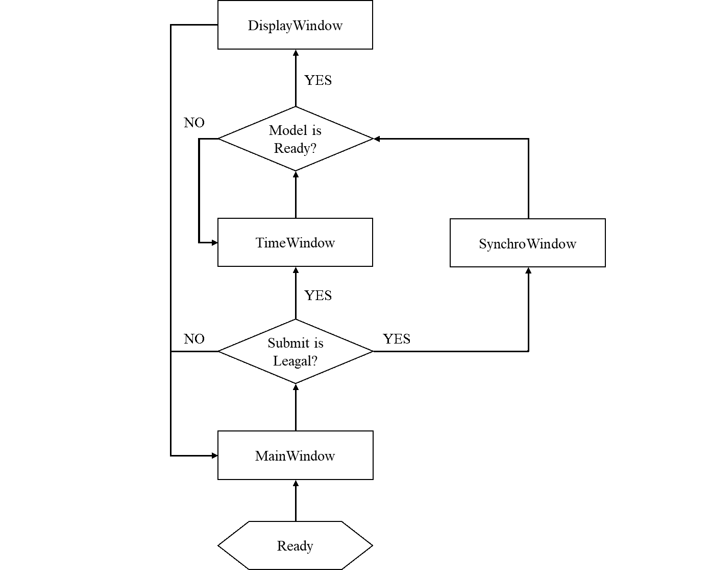

# Multimodal-Emotion-Analysis-Algorithm-Combining-Text-and-Images
multimodal-sarcasm-detection 多模态反讽检测

**[中文](./README.md)**

**[English ](./README_EN.md)**

****
## 目录
* [前言](#前言)
* [效果图](#效果图)
* [文件结构](#文件结构)
* [库及版本](#库及版本)
* [模型架构](#模型架构)
* [GUI结构](#GUI结构)
* [简单的介绍](#简单的介绍)
   * [项目背景](#项目背景)
   * [参数设置](#参数设置)
   * [数据增强](#数据增强)

## 前言
　　本项目之前是复现论文的前提下进行改进，原论文地址： https://aclanthology.org/P19-1239/

　　效果(未进行数据增强)：acc:0.917, pre:0.871, rec:0.930, **f1:0.900**, acu:0.956, loss:0.3920

比原论文(f1=0.801)的效果好一些, Funtciuon.py 中需要更改 rootPath

## 效果图

## 文件结构
```
.
│  ReadMe.md 
├─codes - 主运行文件夹
│  │  ImageFeature.py      - 处理图片特征的网络
│  │  ExtractFeature.py    - 处理类别特征的网络
│  │  TextFeature.py       - 处理文本特征的网络
│  │  NNManager.py         - 总网络框架
│  │  Main.py              - 主函数
│  │  Attention.py         - 注意力机制
│  │  Function.py          - 静态函数和变量
│  │  ImageRegionNet.py    - 生成图像向量
│  │  MyDataSet.py         - 构造数据集
│  │  ResNet.py            - 残差网络
│  │  DATASET.py           - 枚举类
│  │  DataAugment.py       - 数据增强
│  │  废弃代码.py
│  │  
│  ├─ablation - 消融实验
│  │      DeleteEFNet.py   - 删除早期融合
│  │      DeleteRFNet.py   - 删除表示融合
│  │      ReplaceEFNet.py  - 利用图像特征进行早期融合
│  │      
│  ├─modelCompare - 模型比较
│  │      BiLSTMBert.py    - 仅文本特征
│  │ 
├─image - 图像
│  ├─imageDataSet          - 原图片
│  ├─augmentImages         - 数据增强后的图片
│  └─imageVector           - 图片向量
|
├─class
│     classGloveVector.npy - 预训练Glove向量 
│     classVocab.py3       - 类别词表
│     image2class.py3      - augmentImages+imageDataSet 对应的类别
│     image2classBefore.py3- imageDataSet 对应类别
|
├─text
│     textGloveVector.npy  - 预训练的Glove向量
│     textVocab.py3        - 单词词表
│     test_text            - 文本数据
│     train_text           - 训练集 0.8
│     text.txt             - 测试集 0.1
│     valid_text           - 验证集 0.1
|
├─modelWeights - 预训练模型参数
│  │  resnet50.pth         - # https://download.pytorch.org/models/
│  │  
│  └─bert-base-cased       - # https://huggingface.co/bert-base-cased
│          
└─outputs # 项目输出
   └─****-**-**
      │  ****-**-**.pth    - 模型参数
      │  describe.txt      - 训练时验证集 logs
      │  logs.py3          - trian test valid lr 变化
      |    
      └─runs               - TensorBoard 文件  1. cd 当前文件夹 2. tensorboard --logdir=runs 3. 打开网址
```
## 库及版本
Win10 + Anaconda + CUDA　11.1
|     名称     |    版本     |
| :----------: | :---------: |
|    python    |    3.8.0    |
|   pytorch    | 1.8.1+cu111 |
|  matplotlib  |    3.4.2    |
| scikit-learn |    1.2.2    |
| transformers |   4.29.1    |
|    pillow    |    9.5.0    |

```
pip install ***==**** -i https://pypi.tuna.tsinghua.edu.cn/simple/
```

## 模型架构


## GUI结构
20230531



## 简单的介绍
### 项目背景


　　本项目是本人的本科论文的源代码，由于论文写的太烂，这里就不献丑了。本项目的就是基于图像和文本在前人[Cai等人](https://aclanthology.org/P19-1239/)的基础上，进行反讽检测，在实现中，我改变的他的网络结构，加入了注意力机制进行融合，提高了些精度，收敛效果也是不错的。如果源码有什么错误或者更好的实现，欢迎交流。真诚的感谢原论文的作者们才能让我完成了这个项目，他们也提交了原论文的代码，[start一下](https://github.com/headacheboy/data-of-multimodal-sarcasm-detection)。

### 参数设置
　　这些参数是我手调的，一定还有比这个更好的，还请提醒一下，感谢
|       **Hyper-parameters**        | **Values** |
| :-------------------------------: | :--------: |
|           Learning rate           |    1e-4    |
|            Batch size             |    128     |
|             Norm type             |     2      |
|         Gradient Clipping         |     10     |
|              Dropout              |    0.1     |
|         LSTM hidden size          |    256     |
|          LSTM num layers          |     2      |
| Word and attribute embedding size |    200     |
|           Sequence len            |     80     |
|          ResNet FC size           |    1024    |
|       Modality fusion size        |    512     |

### 数据增强
　　基于[MixGen](https://arxiv.org/abs/2206.08358)算法多模态的数据增强方法,公式如下：

$$I_{new}=\varphi\bullet I_{base}+\left(1-\varphi\right)\bullet I_{insert}$$

$$T_new=RandomInsert(T_insert,T_base,\varphi)$$

　　其中，φ为保留I_base  or T_base的比例，在本任务中φ≥0.7，以保证语义关系是匹配的。效果：


