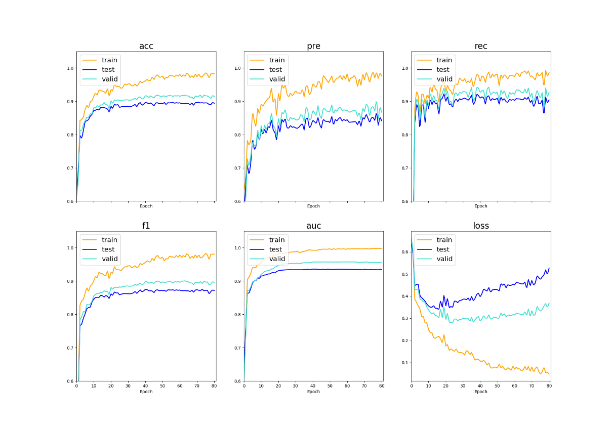

# Multimodal-Emotion-Analysis-Algorithm-Combining-Text-and-Images
multimodal-sarcasm-detection

**[中文](./README.md)**

**[English](./README_EN.md)**

****
## Catalogue
* [Foreword](#Foreword)
* [Rendering](#Rendering)
* [FileStructure](#FileStructure)
* [LibrariesAndVersions](#LibrariesAndVersions)
* [TheModelArchitecture](#TheModelArchitecture)
* [ABriefIntroduction](#ABriefIntroduction)
   * [ProjectBackground](#ProjectBackground)
   * [ParameterSettings](#ParameterSettings)
   * [DataAugmentation](#DataAugmentation)

## Foreword
This project was improved under the premise of reproducing the paper, the address of the original paper：https://aclanthology.org/P19-1239/

Performance：acc:0.917, pre:0.871, rec:0.930, **f1:0.900**, acu:0.956, loss:0.3920
Better than the original paper

## Rendering


## FileStructure
```
.
│  ReadMe.md 
├─codes - Main Running folder
│  │  ImageFeature.py      - Networks that process features of pictures
│  │  ExtractFeature.py    - Networks that deal with category features
│  │  TextFeature.py       - Networks that process text features
│  │  NNManager.py         - Total network framework
│  │  Main.py              - main
│  │  Attention.py         - Attention mechanism
│  │  Function.py          - Static functions and variables
│  │  ImageRegionNet.py    - Generate image vectors
│  │  MyDataSet.py         - Constructing the dataset
│  │  ResNet.py            - ResNet
│  │  DATASET.py           - Enumeration
│  │  DataAugment.py       - Data augmentation
│  │  废弃代码.py
│  │  
│  ├─ablation - Ablation experiment
│  │      DeleteEFNet.py   - Delete early fusion
│  │      DeleteRFNet.py   - Delete representation fusion
│  │      ReplaceEFNet.py  - Image features were used for early fusion
│  │      
│  ├─modelCompare - Comparison of models
│  │      BiLSTMBert.py    - Text features only
│  │ 
├─image - 
│  ├─imageDataSet          - Original image
│  ├─augmentImages         - Image after data augmentation
│  └─imageVector           - Image vector
|
├─class
│     classGloveVector.npy - Pre-trained Glove vectors 
│     classVocab.py3       - Category vocabulary
│     image2class.py3      - augmentImages+imageDataSet Corresponding category
│     image2classBefore.py3- imageDataSet Corresponding category
|
├─text
│     textGloveVector.npy  - Pre-trained Glove vectors 
│     textVocab.py3        - Words vocabulary
│     text.txt             - Text
│     train_text           - Train set 0.8
│     test_text            - Test set 0.1
│     valid_text           - Valid set 0.1
|
├─modelWeights - Pre-trained model parameters
│  │  resnet50.pth         - # https://download.pytorch.org/models/
│  │  
│  └─bert-base-cased       - # https://huggingface.co/bert-base-cased
│          
└─outputs 
   └─****-**-**
      │  ****-**-**.pth    - Model parameters
      │  describe.txt      - logs
      │  logs.py3          - trian test valid lr 
      |    
      └─runs               - TensorBoard   1. cd The current folder 2. tensorboard --logdir=runs 3. Open the URL
```
## LibrariesAndVersions
Win10 + Anaconda
|     Name     |   Version   |
| :----------: | :---------: |
|    python    |    3.8.0    |
|   pytorch    | 1.8.1+cu111 |
|  matplotlib  |    3.4.2    |
| scikit-learn |    1.2.2    |
| transformers |   4.29.1    |
|    pillow    |    9.5.0    |

```
pip install ***==**** -i https://pypi.tuna.tsinghua.edu.cn/simple/
```

## TheModelArchitecture


## ABriefIntroduction
### ProjectBackground


　　This project is my undergraduate paper source code, because the paper is too bad, here is not a disgrace. [the project is based on images and text on the Cai et al.] (https://aclanthology.org/P19-1239/), on the basis of detection of irony, in the implementation, I change his network structure, joined the attention mechanism, improves the precision, convergence effect also is pretty good. If there are any errors in the source code or better implementation, welcome to communicate. Sincerely thank the authors of the original papers that I can finished this project, they also submit the code of original papers, [start the] (https://github.com/headacheboy/data-of-multimodal-sarcasm-detection).

### ParameterSettings
　　These parameters are my hand adjustment, there must be better than this, please remind me, thank you
|       **Hyper-parameters**        | **Values** |
| :-------------------------------: | :--------: |
|           Learning rate           |    1e-4    |
|            Batch size             |    128     |
|             Norm type             |     2      |
|         Gradient Clipping         |     10     |
|              Dropout              |    0.1     |
|         LSTM hidden size          |    256     |
|          LSTM num layers          |     2      |
| Word and attribute embedding size |    200     |
|           Sequence len            |     80     |
|          ResNet FC size           |    1024    |
|       Modality fusion size        |    512     |

### DataAugmentation
　　Based on [MixGen] (https://arxiv.org/abs/2206.08358) algorithm of multimodal data enhancement method, formula is as follows:

$$ I_{new}=\varphi\bullet I_{base}+\left(1-\varphi\right)\bullet I_{insert} $$

$$ T_new=RandomInsert(T_insert,T_base,\varphi) $$

　　Where, φ is the ratio of preserving I_base or T_base, and in this task, φ≥0.7 to ensure that the semantic relation is matched. Effect:


